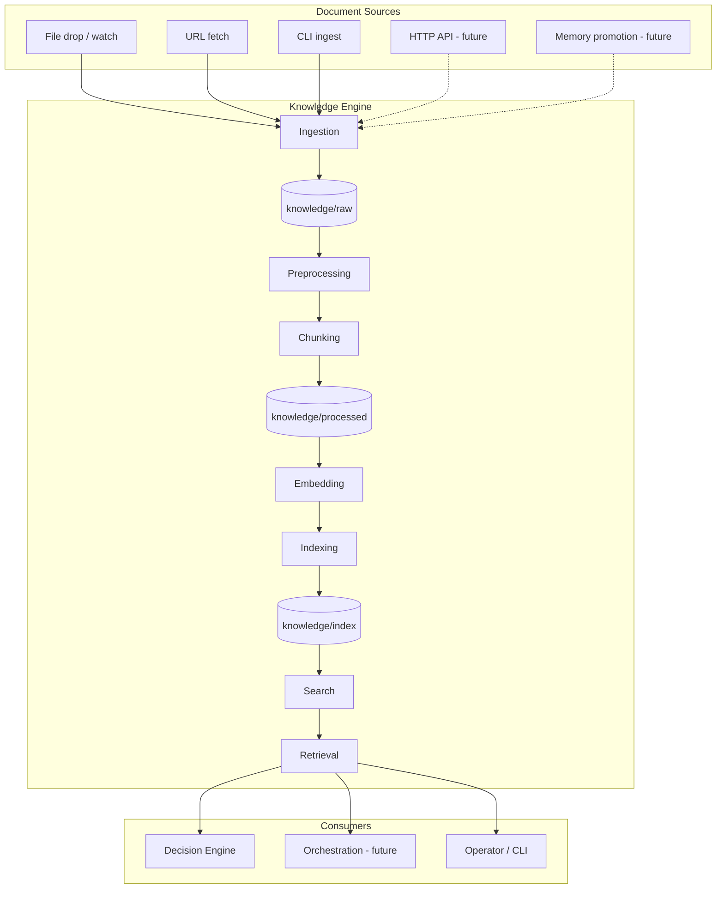
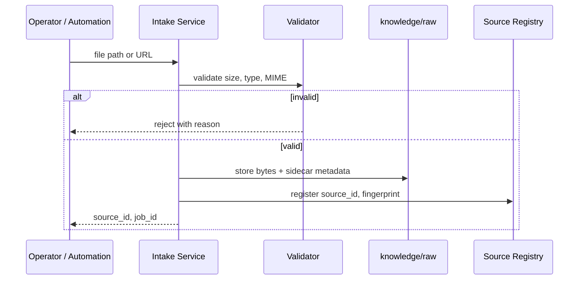
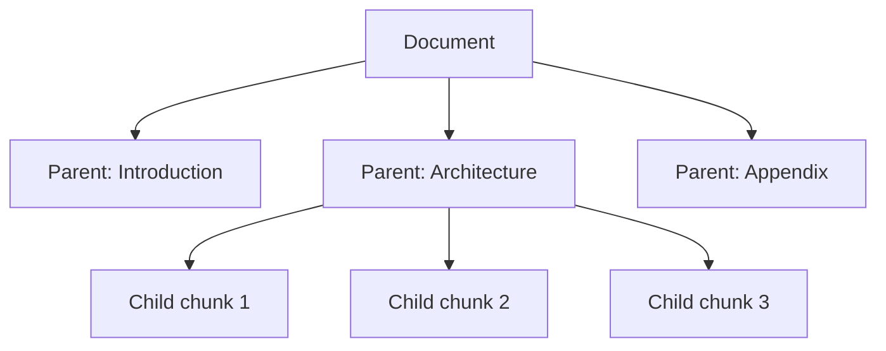
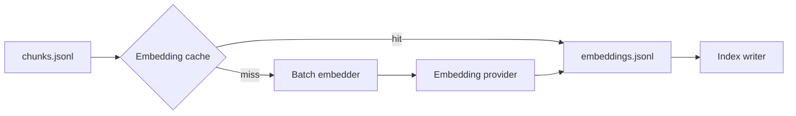
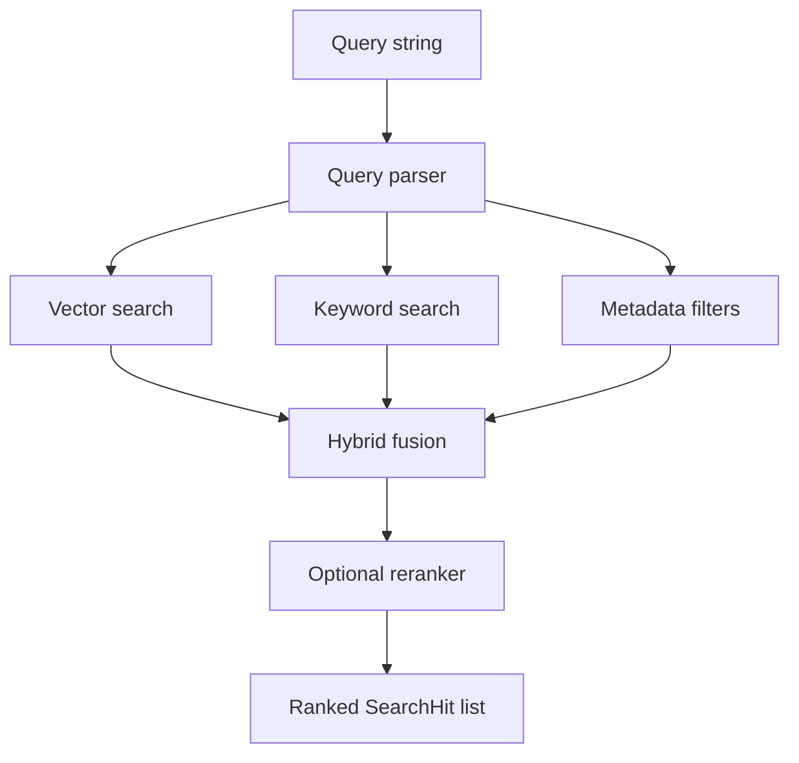
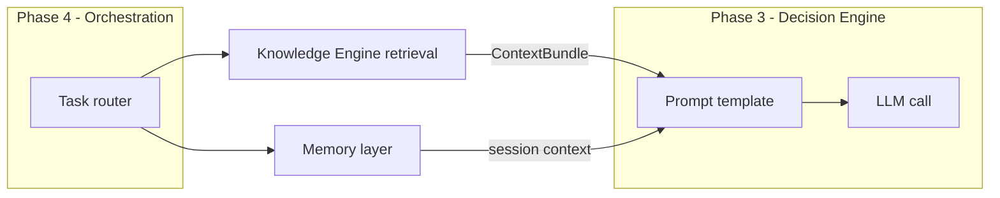

# Knowledge Engine — Architecture

**Phase 1 design** · Status: architecture only (no implementation)

This document defines the production-ready Knowledge Engine for AI-OS: how documents enter the system, how they are transformed into retrievable knowledge, and how other layers (memory, decision engine, future orchestration) consume that knowledge.

It extends [system-overview.md](system-overview.md) with concrete contracts, pipelines, and interfaces. Implementation belongs in a later phase.

---

## Table of contents

1. [Goals and non-goals](#goals-and-non-goals)
2. [Design principles](#design-principles)
3. [System context](#system-context)
4. [End-to-end data flow](#end-to-end-data-flow)
5. [Ingestion — how documents enter](#ingestion--how-documents-enter)
6. [Preprocessing pipeline](#preprocessing-pipeline)
7. [Chunking strategy](#chunking-strategy)
8. [Metadata model](#metadata-model)
9. [Embedding pipeline](#embedding-pipeline)
10. [Indexing pipeline](#indexing-pipeline)
11. [Search pipeline](#search-pipeline)
12. [Retrieval pipeline](#retrieval-pipeline)
13. [Future RAG integration](#future-rag-integration)
14. [Local-first and cloud compatibility](#local-first-and-cloud-compatibility)
15. [Interfaces and extension points](#interfaces-and-extension-points)
16. [Operational concerns](#operational-concerns)
17. [Related documents](#related-documents)

---

## Goals and non-goals

### Goals

| Goal | What it means |
|------|----------------|
| **Production-ready design** | Clear stages, idempotent jobs, failure handling, and observability hooks — not a prototype sketch. |
| **Format coverage** | Markdown, PDF, TXT, DOCX, HTML, and URLs are first-class ingestion sources. |
| **Local-first** | A single machine can ingest, index, and search without cloud dependencies. |
| **Cloud-optional** | Embedding APIs and hosted vector stores plug in via configuration, not rewrites. |
| **Incremental updates** | Re-index only what changed; avoid full rebuilds on every edit. |
| **Auditability** | Every chunk traces back to a source file, version, and processing run. |
| **RAG-ready** | Retrieval output is structured for the decision engine and future orchestration layer. |

### Non-goals (Phase 1 design)

- Implementing extractors, stores, or CLIs
- Multi-tenant isolation or SaaS deployment patterns
- Real-time collaborative editing
- Automatic promotion of LLM output from memory into knowledge (that remains an explicit user action)
- Bundling embedding model weights in the repository

---

## Design principles

1. **Filesystem stages are the source of structural truth.** `knowledge/raw/` → `knowledge/processed/` → `knowledge/index/` mirrors the mental model in the repo README and keeps debugging simple: you can inspect artifacts at each stage.

2. **Canonical intermediate format is Markdown.** All extractors normalize to Markdown with YAML front matter. Markdown is human-readable, diff-friendly, and maps cleanly to heading-based chunking.

3. **Stable identifiers everywhere.** Documents, chunks, embeddings, and index entries use deterministic IDs derived from content hashes and lineage. Re-running a pipeline on unchanged input produces the same IDs.

4. **Pluggable backends, fixed contracts.** Vector store and embedding provider are swappable via environment configuration (see `.env.example`). The *shape* of processed artifacts and API responses does not change when the backend changes.

5. **Fail visibly, recover cheaply.** A bad PDF does not block the whole batch. Errors are recorded in a run manifest; successful documents proceed. Re-runs are idempotent.

6. **Search is hybrid by default.** Semantic search alone misses exact identifiers and rare terms; keyword search alone misses paraphrases. The design assumes both and fuses results.

---

## System context



The Knowledge Engine is a **pipeline plus query surface**. It does not call LLMs for generation; it prepares context that the decision engine and orchestration layer will use in Phase 3–4.

---

## End-to-end data flow

```
┌─────────────┐    ┌──────────────┐    ┌─────────────┐    ┌─────────────┐
│   Source    │───▶│  raw/        │───▶│ processed/  │───▶│  index/     │
│  (file/URL) │    │  immutable   │    │  normalized │    │  searchable │
│             │    │  originals   │    │  + chunks   │    │  vectors    │
└─────────────┘    └──────────────┘    └─────────────┘    └─────────────┘
                         │                    │                    │
                         │                    │                    │
                    intake manifest      document.jsonl        index manifest
                    + source registry    chunks.jsonl          + vector store
                                         embeddings.jsonl      + keyword index
```

**Stage responsibilities:**

| Stage | Directory | Writable by | Primary artifacts |
|-------|-----------|-------------|-------------------|
| Raw | `knowledge/raw/` | Ingestion only | Original bytes, fetch snapshots, intake manifest |
| Processed | `knowledge/processed/` | Preprocessing through chunking | Normalized markdown, `document.jsonl`, `chunks.jsonl` |
| Index | `knowledge/index/` | Embedding and indexing | `embeddings.jsonl`, vector store files, BM25 index, manifests |

Detailed stage contracts live in [knowledge/schema.md](../../knowledge/schema.md) and [knowledge/pipeline.md](../../knowledge/pipeline.md).

---

## Ingestion — how documents enter

Documents can enter through multiple **intake channels**. All channels converge on the same intake contract and land in `knowledge/raw/`.

### Intake channels

| Channel | Phase | Description |
|---------|-------|-------------|
| **File drop** | 1 | Operator copies or saves files into `knowledge/raw/` (or a configured inbox subdirectory). |
| **Directory watch** | 1 | A local watcher detects new or modified files and enqueues intake jobs. |
| **CLI ingest** | 1 | `ingest file <path>` and `ingest url <url>` copy or fetch into raw with metadata. |
| **URL fetch** | 1 | HTTP(S) retrieval with snapshot of HTML and extracted text; respects `robots.txt` when enabled. |
| **HTTP API** | 4 | Authenticated upload endpoint for automation and integrations. |
| **Memory promotion** | 4 | User-approved content from `memory/` is written to raw as a new source document. |

### Intake flow



### Design decisions (ingestion)

**Why copy into `raw/` instead of indexing in place?**

External paths change, network URLs expire, and in-place indexing makes it hard to prove what was indexed. Copying (or snapshotting) into `raw/` gives a stable, local audit trail. The original path or URL is recorded in metadata, not relied upon at query time.

**Why a source registry?**

The registry maps `source_id` → fingerprint, intake time, and current processing status. Incremental pipelines consult the registry to skip unchanged files and to tombstone deleted sources.

**Supported formats at intake:**

| Format | Extensions / signal | Intake behavior |
|--------|---------------------|-----------------|
| Markdown | `.md`, `.markdown` | Store as-is; validate UTF-8 |
| PDF | `.pdf` | Store binary; magic-byte check |
| Plain text | `.txt` | Store as-is; detect encoding |
| Word | `.docx` | Store binary (OOXML only; not legacy `.doc`) |
| HTML | `.html`, `.htm` | Store snapshot; optional readability extraction later |
| URL | `http://`, `https://` | Fetch HTML; store snapshot + final URL after redirects |

Legacy `.doc`, scanned PDFs without OCR, and password-protected files are rejected with explicit error codes (see [knowledge/pipeline.md](../../knowledge/pipeline.md)).

---

## Preprocessing pipeline

Preprocessing transforms raw bytes into **normalized markdown documents** ready for chunking. It runs as a staged, resumable job per `source_id`.

### Pipeline stages

```
┌──────────┐   ┌────────────┐   ┌──────────────┐   ┌─────────────┐   ┌──────────┐
│  Detect  │──▶│  Extract   │──▶│  Normalize   │──▶│  Enrich     │──▶│  Persist │
│  format  │   │  text/structure│  to markdown │   │  metadata   │   │  document│
└──────────┘   └────────────┘   └──────────────┘   └─────────────┘   └──────────┘
```

| Stage | Input | Output | Plain-English rationale |
|-------|-------|--------|-------------------------|
| **Detect** | Raw file bytes | MIME type, format enum | Route to the correct extractor without trusting file extensions alone. |
| **Extract** | Raw bytes | Structured text + blocks (headings, lists, tables) | Format-specific logic lives here and only here. |
| **Normalize** | Extracted structure | Canonical markdown + front matter | One downstream chunker handles all formats. |
| **Enrich** | Markdown | Metadata fields (title, dates, language, tags) | Enrichment merges extractor hints, front matter, and file stats. |
| **Persist** | Document + metadata | `processed/documents/{doc_id}/` | One folder per logical document keeps artifacts navigable. |

### Format-specific extraction strategy

| Format | Extraction approach | Normalization notes |
|--------|----------------------|---------------------|
| **Markdown** | Parse AST; preserve heading hierarchy | Strip unsafe HTML; unify line endings |
| **PDF** | Text extraction per page; layout blocks | Page markers as `<!-- page: N -->` comments |
| **TXT** | Encoding detection; paragraph split heuristics | Infer title from first line if short |
| **DOCX** | OOXML body → structure (headings, lists) | Map Word styles to markdown heading levels |
| **HTML** | DOM parse; main-content heuristic (readability) | Remove scripts, nav, ads; resolve relative links |
| **URL** | Same as HTML on fetched snapshot | Store `final_url`, `fetched_at`, HTTP status |

### Error handling

| Failure type | Behavior |
|--------------|----------|
| Corrupt file | Mark source `failed`; log error; continue batch |
| Empty extraction | Mark `failed` with `EMPTY_CONTENT` |
| Partial PDF text | Process with `quality: degraded` flag in metadata |
| Encoding unknown | Attempt UTF-8, then Latin-1; else `failed` |

### Design decision: Markdown as the lingua franca

We chose Markdown over JSON or HTML as the processed text format because operators can read and edit it, git diffs remain meaningful for curated content, and heading-based chunking is straightforward. Structured data (tables, code blocks) is preserved in fenced blocks rather than lossy plain-text flattening.

---

## Chunking strategy

Chunking splits normalized documents into **retrieval units** — pieces small enough for embedding models and LLM context windows, but large enough to preserve meaning.

### Chunking model: hierarchical structure-aware

AI-OS uses a **two-level chunk hierarchy**:

1. **Parent chunks** — logical sections aligned to heading boundaries (H1–H3 where possible).
2. **Child chunks** — smaller windows inside parents for precise retrieval.



**Why parent and child?**

Parent chunks give the LLM broader context when needed; child chunks improve retrieval precision. At query time, a hit on a child can expand to its parent for RAG context assembly (see [Retrieval pipeline](#retrieval-pipeline)).

### Splitting rules

| Rule | Default | Configurable via |
|------|---------|------------------|
| Target child size | 512 tokens | `KNOWLEDGE_CHUNK_SIZE` |
| Overlap | 64 tokens | `KNOWLEDGE_CHUNK_OVERLAP` |
| Max parent size | 2,048 tokens | `config/knowledge.yaml` |
| Min chunk size | 32 tokens | `config/knowledge.yaml` |
| Split priority | Headings → paragraphs → sentences → characters | fixed algorithm |

**Split priority explained:** We try to break on headings first so chunks respect document structure. If a section is still too large, we split on paragraph boundaries, then sentences, and only as a last resort split mid-sentence. This reduces fragments like half a bullet list.

### Special content handling

| Content type | Strategy |
|--------------|----------|
| Code blocks | Keep fenced blocks intact; never split inside a fence |
| Tables | Keep as single chunk if under max size; else split by row groups with header repeat |
| Lists | Prefer keeping a list in one chunk; split between items if necessary |
| PDF page markers | Page numbers attach to chunk metadata, not inline in embed text |

### Chunk identity

```
chunk_id = hash(doc_id + chunk_path + content_hash)
chunk_path = slash-separated heading trail, e.g. "architecture/ingestion"
```

Deterministic IDs make re-indexing idempotent: unchanged content yields the same `chunk_id`, so embeddings can be skipped when fingerprints match.

---

## Metadata model

Metadata is split across three layers: **source**, **document**, and **chunk**. Full field definitions are in [knowledge/metadata-schema.md](../../knowledge/metadata-schema.md).

### Layer summary

| Layer | Carried on | Purpose |
|-------|------------|---------|
| Source | Intake registry | Provenance, change detection, deletion |
| Document | `document.jsonl`, front matter | Title, authorship, tags, processing version |
| Chunk | `chunks.jsonl`, index payload | Offsets, heading path, parent link, embed text |

### Cross-cutting fields

Every indexed record includes:

- `source_id`, `doc_id`, `chunk_id`
- `content_hash` (SHA-256 of normalized embed text)
- `pipeline_version` (semver of processing logic)
- `created_at`, `updated_at`
- `language` (BCP 47, e.g. `en`)

**Why three layers?**

Source metadata answers “where did this come from and did the file change?” Document metadata answers “what is this artifact?” Chunk metadata answers “what exact passage was retrieved?” Mixing these causes leaky filters and complicates incremental updates.

---

## Embedding pipeline

The embedding pipeline converts chunk text into dense vectors and prepares them for the index.

### Flow



### Provider abstraction

| Provider key | Typical use | Notes |
|--------------|-------------|-------|
| `openai` | Cloud, high quality | Default in `.env.example` |
| `ollama` / `local` | Offline, privacy | Dimension must match index config |
| `huggingface` | Self-hosted models | Model path via config, not repo |

**Interface contract:** `embed(texts: string[]) → vectors[][]` plus `dimensions()` and `model_id()`.

### Batch and cache behavior

- **Batch size:** `EMBEDDING_BATCH_SIZE` (default 100)
- **Cache key:** `hash(model_id + content_hash)` — stored alongside `embeddings.jsonl`
- **Skip logic:** If `content_hash` unchanged and model unchanged, skip re-embedding
- **Rate limits:** Exponential backoff per provider; failed batches retry without blocking unrelated documents

### Design decision: cache embeddings on disk

Rebuilding a vector store should not require re-calling paid APIs. Cached embeddings in `knowledge/index/embeddings/` make index rebuilds cheap and reproducible.

### Dimension consistency

Changing `EMBEDDING_MODEL` or `EMBEDDING_DIMENSIONS` requires a **full re-embed** of affected documents. The index manifest tracks `embedding_model` and `embedding_dimensions`; mismatches trigger a compatibility warning at startup.

---

## Indexing pipeline

Indexing writes searchable structures: a **vector index** for semantic search and a **keyword index** for lexical search.

### Components

```
processed/chunks.jsonl
        │
        ├──────────────────────┬─────────────────────┐
        ▼                      ▼                     ▼
  Vector index            Keyword index         Index manifest
  (ANN / flat)            (BM25 / Tantivy)      (versions, counts)
```

### Vector store backends

Configured via `VECTOR_STORE` (from `.env.example`):

| Backend | Local-first fit | When to use |
|---------|-----------------|-------------|
| `local` (default) | Excellent | Single machine, no extra services |
| `lancedb` | Excellent | Larger corpora, disk-efficient |
| `chroma` | Good | Familiar API, local server |
| `qdrant` | Good | Local or remote |
| `pgvector` | Cloud | Postgres already in stack |
| `pinecone` | Cloud | Managed scale |

**Design decision: abstract behind `VectorStore` interface**

Callers use `upsert`, `delete`, and `search` — not provider SDKs directly. This keeps the indexing pipeline identical whether vectors live in a folder or a hosted service.

### Keyword index

A BM25-style inverted index covers `chunk_id`, `title`, `heading_path`, and body text. Keyword search is essential for:

- Exact error codes, API names, version numbers
- Rare tokens that embed poorly
- Hybrid fusion with semantic results

### Incremental indexing

1. Compare source fingerprints in the registry.
2. For changed documents: delete old `doc_id` vectors and keyword postings; insert new chunks.
3. For deleted sources: tombstone and remove index entries.
4. Update `index/manifest.json` with counts and timestamps.

### Index manifest (conceptual)

```json
{
  "index_version": "1",
  "embedding_model": "text-embedding-3-small",
  "embedding_dimensions": 1536,
  "vector_store": "local",
  "document_count": 42,
  "chunk_count": 318,
  "last_full_rebuild_at": null,
  "last_incremental_at": "2026-07-11T12:00:00Z"
}
```

---

## Search pipeline

Search answers: **which chunks match a query?** It does not assemble LLM prompts — that is retrieval.

### Query path



### Hybrid fusion

Default strategy: **reciprocal rank fusion (RRF)** across vector and keyword result lists.

| Parameter | Default | Purpose |
|-----------|---------|---------|
| `vector_top_k` | 20 | Candidates from semantic search |
| `keyword_top_k` | 20 | Candidates from BM25 |
| `rrf_k` | 60 | RRF constant |
| `final_top_k` | 10 | Results returned to retrieval layer |

**Why hybrid?**

Pure semantic search drifts on precise tokens (“`KNOWLEDGE_CHUNK_SIZE`”, UUIDs, legal citations). Pure keyword search misses paraphrases. RRF is simple, requires no training data, and behaves well on small personal corpora.

### Metadata filters

Filters are optional and combine with AND semantics:

- `source_id`, `doc_id`, `tags`, `language`
- `date_range` on `document.created_at`
- `content_type` (e.g. only `pdf`)

### Optional reranking

A cross-encoder or lightweight LLM reranker can reorder the top 20 fused hits. Disabled by default for local-first latency; enabled via feature flag when cloud models are available.

---

## Retrieval pipeline

Retrieval answers: **what context should downstream reasoning use?** It sits on top of search and produces a structured **context bundle** for the decision engine and future RAG flows.

### Retrieval modes

| Mode | Use case |
|------|----------|
| `search` | Return ranked chunks with citations only |
| `context` | Assemble prompt-ready context string with citation markers |
| `expand_parent` | Replace child hits with parent chunk text for broader context |

### Context assembly

```
1. search(query, filters, top_k)
2. deduplicate by doc_id (max N chunks per document)
3. expand parents if mode requires
4. trim to token budget (retrieval_max_tokens)
5. format ContextBundle
```

### ContextBundle (interface)

```typescript
interface ContextBundle {
  query: string;
  chunks: RetrievedChunk[];
  citations: Citation[];
  token_estimate: number;
  retrieval_metadata: {
    search_mode: "hybrid" | "vector" | "keyword";
    rerank_enabled: boolean;
    latency_ms: number;
  };
}

interface RetrievedChunk {
  chunk_id: string;
  doc_id: string;
  text: string;
  score: number;
  heading_path: string;
  source_uri: string;
}

interface Citation {
  cite_key: string;       // e.g. "[1]"
  chunk_id: string;
  title: string;
  source_uri: string;
  excerpt: string;
}
```

**Design decision: citations are first-class**

Downstream prompts must attribute sources. Each chunk receives a stable `cite_key` so the decision engine can instruct the model to reference `[1]`, `[2]`, etc., and auditors can trace answers back to files.

---

## Future RAG integration

RAG (retrieval-augmented generation) is not implemented in Phase 1, but the Knowledge Engine is shaped to support it in Phase 3–4.

### Integration points



| Integration | Contract |
|-------------|----------|
| Decision engine → retrieval | `retrieve(query, options) → ContextBundle` |
| Prompt templates | Placeholder `{{knowledge_context}}` filled from bundle |
| Orchestration | Router chooses when to retrieve vs. skip |
| Write-back | Approved LLM outputs may be ingested via memory promotion → raw |

### RAG options (future config)

| Option | Default | Description |
|--------|---------|-------------|
| `retrieval_top_k` | 8 | Chunks before deduplication |
| `retrieval_max_tokens` | 4,000 | Context token budget |
| `max_chunks_per_doc` | 2 | Diversity across documents |
| `expand_parents` | true | Broader context for child hits |

### What we deliberately defer

- Query rewriting and HyDE (hypothetical document embeddings)
- Agentic multi-hop retrieval loops
- Automatic chunk quality scoring with LLM judges

These can be experiments in `experiments/` before promotion.

---

## Local-first and cloud compatibility

### Local-first profile (default)

| Component | Local choice |
|-----------|--------------|
| Raw/processed storage | Files under `knowledge/` |
| Embedding | `ollama` or `local` provider |
| Vector store | `local` or `lancedb` on disk |
| Keyword index | Embedded BM25 files in `knowledge/index/` |
| Secrets | `.env` only; never committed |

A laptop with no network can ingest TXT and Markdown, embed with a local model, and search.

### Cloud-compatible profile

| Component | Cloud choice |
|-----------|--------------|
| Embedding | `openai` or other API |
| Vector store | `pinecone`, `qdrant` cloud, `pgvector` |
| Object storage | `S3_*` vars for large raw files |
| Observability | `OTEL_*`, `SENTRY_DSN` |

**Same artifacts, different backends.** Processed JSONL files remain on disk (or sync to object storage); only the index backend changes.

### Environment mapping

| Concern | Variables |
|---------|-----------|
| Paths | `KNOWLEDGE_RAW_DIR`, `KNOWLEDGE_PROCESSED_DIR`, `KNOWLEDGE_INDEX_DIR` |
| Chunking | `KNOWLEDGE_CHUNK_SIZE`, `KNOWLEDGE_CHUNK_OVERLAP` |
| Embeddings | `EMBEDDING_PROVIDER`, `EMBEDDING_MODEL`, `EMBEDDING_DIMENSIONS` |
| Vector store | `VECTOR_STORE`, `VECTOR_STORE_PATH`, provider-specific host vars |

Committed defaults and schemas will live in `config/knowledge.yaml` (to be added at implementation time).

---

## Interfaces and extension points

### Core interfaces (conceptual TypeScript)

```typescript
// Ingestion
interface IntakeRequest {
  kind: "file" | "url";
  path_or_url: string;
  tags?: string[];
  metadata?: Record<string, unknown>;
}
interface IntakeResult {
  source_id: string;
  job_id: string;
  status: "accepted" | "rejected";
  reason?: string;
}

// Extraction
interface Extractor {
  supportedFormats: Format[];
  extract(raw: RawArtifact): Promise<ExtractedDocument>;
}

// Chunking
interface Chunker {
  chunk(document: NormalizedDocument, options: ChunkOptions): Chunk[];
}

// Embedding
interface EmbeddingProvider {
  modelId(): string;
  dimensions(): number;
  embed(texts: string[]): Promise<number[][]>;
}

// Storage
interface VectorStore {
  upsert(records: VectorRecord[]): Promise<void>;
  delete(chunkIds: string[]): Promise<void>;
  search(vector: number[], topK: number, filter?: MetadataFilter): Promise<ScoredHit[]>;
}

// Search & retrieval
interface KnowledgeSearch {
  search(query: SearchQuery): Promise<SearchHit[]>;
}
interface KnowledgeRetrieval {
  retrieve(query: RetrievalQuery): Promise<ContextBundle>;
}
```

### Extension points

| Extension | Register via | Notes |
|-----------|--------------|-------|
| Extractors | `config/knowledge.yaml` → `extractors` | One per format family |
| Embedding providers | `EMBEDDING_PROVIDER` | Must declare dimensions |
| Vector stores | `VECTOR_STORE` | Same `VectorRecord` contract |
| Enrichment hooks | Pipeline plugin slot | e.g. language detection, NER |

---

## Operational concerns

### Idempotency and reproducibility

- Processing jobs keyed by `(source_id, pipeline_version)`
- Content-addressed hashes determine skip vs. reprocess
- Index manifests record tool versions for debugging “why did this chunk change?”

### Observability (hooks for Phase 5)

| Event | Fields |
|-------|--------|
| `ingest.completed` | `source_id`, `duration_ms`, `bytes` |
| `process.completed` | `doc_id`, `chunk_count`, `status` |
| `index.completed` | `chunks_indexed`, `embeddings_skipped` |
| `search.executed` | `query_hash`, `latency_ms`, `hit_count` |

### Security and privacy

- Raw and processed dirs are gitignored; operators control disk encryption
- URL fetch respects blocklists and optional domain allowlists
- No automatic exfiltration of raw content to cloud embed APIs without explicit provider configuration

### Capacity guidance (personal corpus)

Designed for **10³–10⁵ chunks** on a single machine. Beyond that, prefer `lancedb` or external vector stores and scheduled incremental indexing.

---

## Related documents

| Document | Contents |
|----------|----------|
| [knowledge/pipeline.md](../../knowledge/pipeline.md) | Stage-by-stage pipeline specification |
| [knowledge/schema.md](../../knowledge/schema.md) | File layouts and JSON schemas |
| [knowledge/metadata-schema.md](../../knowledge/metadata-schema.md) | Field-level metadata reference |
| [ADR-001-knowledge-engine.md](../decisions/ADR-001-knowledge-engine.md) | Recorded architectural decisions |
| [system-overview.md](system-overview.md) | AI-OS layers and evolution phases |

---

*This document is design-only. Update it when ADRs supersede decisions or when implementation discovers material constraints.*
