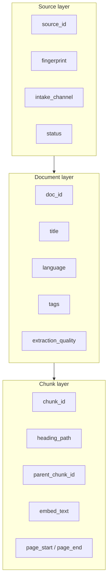

# Knowledge Engine — Metadata Schema

**Phase 1 design** · Status: specification only (no implementation)

This document defines the meaning, constraints, and lifecycle of every metadata field in the Knowledge Engine. JSON shapes appear in [schema.md](schema.md); this document explains **why fields exist** and **how to use them**.

---

## Design goals for metadata

1. **Provenance** — Any chunk can be traced to a file, URL, and ingestion time.
2. **Change detection** — Fingerprints and hashes determine what to reprocess.
3. **Filtering** — Search can narrow by tags, language, format, and dates.
4. **Citation** — Retrieval can attribute excerpts to titled sources.
5. **Quality signals** — Downstream systems can down-rank degraded extractions.

---

## Metadata layers



| Layer | Question it answers | Primary storage |
|-------|---------------------|-----------------|
| Source | Where did this come from? Did the bytes change? | `sources.jsonl`, `intake.json` |
| Document | What is this logical work? | `document.meta.json`, front matter |
| Chunk | What exact passage is retrieved? | `chunks.jsonl`, index payload |

---

## Source-layer fields

### Identity and lifecycle

| Field | Type | Required | Description |
|-------|------|----------|-------------|
| `source_id` | string | yes | Permanent identifier for a source artifact. Never reused after tombstone. |
| `status` | enum | yes | `pending` → `processing` → `ready` \| `failed`. Also `tombstoned`, `unchanged`. |
| `format` | enum | yes | `markdown`, `txt`, `pdf`, `docx`, `html`, `url` |
| `created_at` | ISO 8601 | yes | First successful intake |
| `updated_at` | ISO 8601 | yes | Last registry mutation |

**Plain English:** `source_id` is the handle you use to reprocess or delete a file. `status` tells automation whether downstream jobs should run.

### Provenance

| Field | Type | Required | Description |
|-------|------|----------|-------------|
| `original_filename` | string | file only | Name at intake time |
| `original_uri` | string | yes | `file://` path or original URL |
| `intake_channel` | enum | yes | `drop`, `watch`, `cli`, `api`, `promotion` |
| `fingerprint` | string | yes | `sha256:` + hex digest of raw bytes (or response body for URLs) |
| `fingerprint_algorithm` | string | yes | Always `sha256` in Phase 1 |
| `byte_size` | integer | yes | Size of stored raw artifact |

**Plain English:** Provenance fields answer audit questions: “Which file on disk produced this answer?” and “Was it the same file we indexed last week?”

### Change detection

When a watcher or CLI re-ingests a path:

1. Look up existing registry entries with matching `original_uri` (or configured alias key).
2. Compare `fingerprint`.
3. If equal → set `unchanged`, skip pipeline.
4. If different → reuse `source_id`, bump `updated_at`, run pipeline.

**Design decision:** We key on fingerprint, not `mtime`. Content can change without timestamp updates (some sync tools). Hashing is slower but trustworthy.

### URL-specific fields

| Field | Type | Description |
|-------|------|-------------|
| `final_url` | string | URL after redirects |
| `fetched_at` | ISO 8601 | When snapshot was taken |
| `http_status` | integer | HTTP response code |
| `content_type` | string | Response `Content-Type` header |

**Plain English:** URLs are unstable. We store what we fetched and when, not a live pointer, so retrieval citations remain valid even if the page changes.

### Operator fields

| Field | Type | Description |
|-------|------|-------------|
| `tags` | string[] | Freeform labels, lowercase recommended |
| `operator_metadata` | object | Arbitrary JSON; not indexed unless promoted to `custom` |

**Tag conventions (recommended, not enforced):**

- Lowercase, hyphen-separated: `api-docs`, `meeting-notes`
- Project prefix optional: `proj-ai-os/architecture`
- Avoid PII in tags (they may appear in logs)

---

## Document-layer fields

### Identity

| Field | Type | Required | Description |
|-------|------|----------|-------------|
| `doc_id` | string | yes | Logical document identifier |
| `source_id` | string | yes | Back-reference to source |
| `title` | string | yes | Human-readable title for citations |

**Plain English:** One PDF usually means one `doc_id`. Future splitters (e.g. multi-chapter PDF → separate docs) may emit multiple `doc_id` values per `source_id`.

### Content characterization

| Field | Type | Required | Description |
|-------|------|----------|-------------|
| `language` | BCP 47 | yes | e.g. `en`, `en-US`, `de` |
| `format` | enum | yes | Original format before normalization |
| `extraction_quality` | enum | yes | `full`, `degraded`, `failed` |
| `page_count` | integer | PDF only | Number of pages |
| `word_count` | integer | yes | Words in normalized body |
| `char_count` | integer | yes | Characters in normalized body |
| `heading_count` | integer | yes | Headings in outline |

**`extraction_quality` guidance:**

| Value | When to set |
|-------|-------------|
| `full` | Clean extraction, structure intact |
| `degraded` | Partial PDF text, boilerplate-heavy HTML, broken tables |
| `failed` | Should not reach index; document marked failed |

### Paths (machine-local)

| Field | Type | Description |
|-------|------|-------------|
| `source_uri` | string | Same as registry `original_uri` |
| `raw_path` | string | Relative path to `original.*` |
| `processed_path` | string | Relative path to `document.md` |

**Plain English:** Paths are relative to the AI-OS repo root so they survive machine moves when data dirs move together.

### Timestamps

| Field | Type | Description |
|-------|------|-------------|
| `created_at` | ISO 8601 | First successful process |
| `updated_at` | ISO 8601 | Last chunk or metadata update |

### Extensibility

| Field | Type | Description |
|-------|------|-------------|
| `custom` | object | Namespaced extensions, e.g. `custom.doi`, `custom.author` |

**Rule:** Unknown `custom` keys are preserved and passed to index filters only if registered in `config/knowledge.yaml` under `index.filterable_custom_keys`.

---

## Chunk-layer fields

### Identity and hierarchy

| Field | Type | Required | Description |
|-------|------|----------|-------------|
| `chunk_id` | string | yes | Stable chunk identifier |
| `doc_id` | string | yes | Parent document |
| `source_id` | string | yes | Denormalized for purge |
| `chunk_level` | enum | yes | `parent` or `child` |
| `parent_chunk_id` | string \| null | yes | Set on child chunks |
| `chunk_index` | integer | yes | Order within document (0-based) |

**Plain English:** `chunk_index` preserves reading order for context assembly. `parent_chunk_id` links a precise child hit back to a broader section.

### Location within document

| Field | Type | Required | Description |
|-------|------|----------|-------------|
| `heading_path` | string | yes | e.g. `introduction/motivation` |
| `start_offset` | integer | yes | Start char in `document.md` body |
| `end_offset` | integer | yes | End char in `document.md` body |
| `page_start` | integer | no | PDF/DOCX page hint |
| `page_end` | integer | no | PDF/DOCX page hint |

**`heading_path` rules:**

- Derived from nearest heading above chunk
- Segments are slugified heading text, lowercase
- Duplicate titles at same level get numeric suffix: `overview-2`

### Text payloads

| Field | Type | Required | Description |
|-------|------|----------|-------------|
| `body_text` | string | yes | Chunk text without context prefix |
| `embed_text` | string | yes | Text embedded (may include title/heading prefix) |
| `content_hash` | string | yes | SHA-256 of normalized `embed_text` |
| `token_count` | integer | yes | Token count per configured tokenizer |
| `char_count` | integer | yes | Length of `body_text` |

**Why two text fields?**

`embed_text` includes a short context prefix so embeddings capture document and section identity. `body_text` is what humans read in citations without redundant prefixes.

**Prefix format (default):**

```
Document: {title} > {heading_path}

{body_text}
```

### Inherited document fields

Chunks duplicate these for index filtering without joining catalogs:

| Field | Source |
|-------|--------|
| `title` | document |
| `language` | document |
| `tags` | document + source |

---

## Embedding-layer fields

| Field | Type | Description |
|-------|------|-------------|
| `embedding_model` | string | Model name at embed time |
| `embedding_provider` | string | Provider key |
| `embedding_dimensions` | integer | Vector length |
| `embedded_at` | ISO 8601 | When vector was produced |
| `cache_hit` | boolean | Whether vector came from cache |

**Plain English:** Storing model metadata on each embedding lets the system detect stale vectors after a model upgrade.

---

## Filterable fields

Search and vector filters may use these fields without custom configuration:

| Field | Type | Operators |
|-------|------|-----------|
| `source_id` | string | `eq`, `in` |
| `doc_id` | string | `eq`, `in` |
| `format` | enum | `eq`, `in` |
| `language` | string | `eq`, `in` |
| `tags` | string[] | `contains`, `contains_any` |
| `extraction_quality` | enum | `eq`, `in` |
| `heading_path` | string | `prefix` |
| `created_at` | datetime | `gte`, `lte`, `range` |
| `updated_at` | datetime | `gte`, `lte`, `range` |

### Filter examples

**Only architecture PDFs in English:**

```json
{
  "filters": {
    "tags": { "contains_any": ["architecture"] },
    "format": { "in": ["pdf"] },
    "language": { "eq": "en" }
  }
}
```

**Exclude degraded extractions:**

```json
{
  "filters": {
    "extraction_quality": { "in": ["full"] }
  }
}
```

---

## Citation metadata

Citations are assembled at retrieval time from chunk + document fields:

| Citation field | Source |
|----------------|--------|
| `cite_key` | Generated `[1]`, `[2]`, … in score order |
| `title` | `document.title` |
| `source_uri` | `document.source_uri` |
| `excerpt` | First N characters of `chunk.body_text` |
| `chunk_id` | `chunk.chunk_id` |
| `heading_path` | `chunk.heading_path` |
| `page_start` | `chunk.page_start` if present |

**Plain English:** Citations are not stored separately; they are a view over chunk and document metadata so they stay consistent when titles are corrected and documents reprocessed.

---

## Field lifecycle by pipeline stage

| Field set | Written at | Updated at |
|-----------|------------|------------|
| Source registry | Intake | Status changes, fingerprint change, tombstone |
| Intake JSON | Intake | Immutable |
| Document meta | Process | Reprocess, tag edits |
| Front matter | Process | Human edit → reconcile on reprocess |
| Chunks | Chunk | Rechunk |
| Embeddings | Embed | Re-embed |
| Index payload | Index | Each upsert/purge |

---

## Privacy and sensitivity

| Rule | Rationale |
|------|-----------|
| Do not put secrets in `tags` or `operator_metadata` | Fields may appear in logs and index payloads |
| Raw/processed dirs are gitignored | Prevents accidental commit of PII |
| URL snapshots may contain session cookies if misconfigured | Intake must strip `Cookie` headers from stored artifacts |
| `operator_metadata` is not embedded | Keeps vectors free of accidental sensitive keys |

Promotion from `memory/` (future) must run through the same intake validation as files.

---

## Custom metadata namespaces

Use reverse-DNS keys inside `custom` to avoid collisions:

```json
{
  "custom": {
    "com.example.project": "ai-os",
    "org.ietf.doi": "10.1234/example",
    "author": "Jane Doe"
  }
}
```

Register filterable custom keys explicitly:

```yaml
# config/knowledge.yaml (future)
index:
  filterable_custom_keys:
    - "com.example.project"
    - "author"
```

---

## Validation rules (summary)

| Field | Constraint |
|-------|------------|
| `source_id`, `doc_id`, `chunk_id` | Match prefix pattern; max length 64 |
| `tags` | Max 32 tags; each max 64 chars |
| `title` | Max 512 chars |
| `language` | Valid BCP 47 tag |
| `fingerprint`, `content_hash` | Must start with `sha256:` |
| `embed_text` | Non-empty for child chunks |
| `operator_metadata` | Max 16 KB serialized |

Validators (implementation phase) enforce these at write time.

---

## Related documents

- [schema.md](schema.md) — JSON record shapes
- [pipeline.md](pipeline.md) — when metadata is produced
- [docs/architecture/knowledge-engine.md](../docs/architecture/knowledge-engine.md)
- [docs/decisions/ADR-001-knowledge-engine.md](../docs/decisions/ADR-001-knowledge-engine.md)
