# Knowledge Engine — Pipeline Specification

**Phase 1 design** · Status: specification only (no implementation)

This document defines each pipeline stage in execution order: inputs, outputs, failure modes, and job boundaries. It complements [docs/architecture/knowledge-engine.md](../docs/architecture/knowledge-engine.md).

---

## Overview

The Knowledge Engine runs as a **directed acyclic pipeline** of discrete jobs. Each job is idempotent, keyed by `source_id` or `doc_id`, and records outcomes in manifests.

```mermaid
flowchart LR
    subgraph intake [1. Intake]
        I1[Validate]
        I2[Store raw]
        I3[Register source]
    end

    subgraph preprocess [2. Preprocess]
        P1[Detect format]
        P2[Extract]
        P3[Normalize]
        P4[Enrich metadata]
        P5[Write document]
    end

    subgraph chunk [3. Chunk]
        C1[Build outline]
        C2[Create parents]
        C3[Create children]
        C4[Write chunks.jsonl]
    end

    subgraph embed [4. Embed]
        E1[Load chunks]
        E2[Cache lookup]
        E3[Batch embed]
        E4[Write embeddings.jsonl]
    end

    subgraph index [5. Index]
        X1[Upsert vectors]
        X2[Upsert keyword postings]
        X3[Update manifest]
    end

    intake --> preprocess --> chunk --> embed --> index
```



### Job types

| Job | Trigger | Input | Output |
|-----|---------|-------|--------|
| `intake` | File drop, watch, CLI, URL | Path or URL | Raw artifact + registry entry |
| `process` | After intake | Raw artifact | Normalized document in `processed/` |
| `chunk` | After process | Document | `chunks.jsonl` |
| `embed` | After chunk | Chunks | `embeddings.jsonl` |
| `index` | After embed | Embeddings + chunks | Vector + keyword indexes |
| `purge` | Source deletion | `source_id` | Tombstones + index deletes |
| `reindex` | Manual or model change | Scope (all / doc / source) | Re-embed + rebuild index |

Jobs may run as a **full pipeline** (`ingest → index`) or independently for incremental maintenance.

---

## Stage 1: Intake

### Purpose

Accept a new or updated source, validate it, store an immutable snapshot in `knowledge/raw/`, and register it for downstream processing.

### Inputs

| Field | Required | Description |
|-------|----------|-------------|
| `kind` | yes | `file` or `url` |
| `path_or_url` | yes | Filesystem path or HTTP(S) URL |
| `tags` | no | Operator-supplied labels |
| `metadata` | no | Arbitrary key-value hints (title override, etc.) |

### Steps

1. **Validate request**
   - File: exists, readable, under `KNOWLEDGE_MAX_FILE_SIZE_MB`
   - URL: scheme `http`/`https`, not on blocklist, optional allowlist check

2. **Detect format**
   - Extension + magic bytes + MIME sniff
   - Map to `Format` enum (see [Format detection](#format-detection))

3. **Compute fingerprint**
   - File: `SHA-256` of raw bytes
   - URL: `SHA-256` of response body after fetch (redirects followed, capped redirects)

4. **Assign or reuse `source_id`**
   - New: `src_` + ULID or UUID
   - Update: if fingerprint matches existing registry entry for same logical source, short-circuit with `unchanged`

5. **Store raw artifact**
   - Path pattern: `knowledge/raw/{source_id}/`
     - `original.{ext}` — bytes as received
     - `intake.json` — intake metadata (see [knowledge/metadata-schema.md](metadata-schema.md))
     - For URLs: `snapshot.html`, `headers.json`

6. **Update source registry**
   - Append to `knowledge/raw/.registry/sources.jsonl`

7. **Enqueue `process` job**

### Outputs

| Artifact | Location |
|----------|----------|
| Raw bytes | `knowledge/raw/{source_id}/original.*` |
| Intake record | `knowledge/raw/{source_id}/intake.json` |
| Registry line | `knowledge/raw/.registry/sources.jsonl` |

### Failure codes

| Code | Meaning | Recoverable |
|------|---------|-------------|
| `INTAKE_FILE_TOO_LARGE` | Exceeds max size | No — operator must split or raise limit |
| `INTAKE_UNSUPPORTED_FORMAT` | Unknown or legacy format | No |
| `INTAKE_READ_ERROR` | IO failure | Yes — retry |
| `INTAKE_URL_BLOCKED` | Domain blocklist | No |
| `INTAKE_URL_FETCH_FAILED` | HTTP error, timeout | Yes — retry with backoff |
| `INTAKE_PASSWORD_PROTECTED` | Encrypted PDF/DOCX | No — operator must decrypt |

---

## Stage 2: Preprocess (extract + normalize)

### Purpose

Convert a raw artifact into a **normalized document**: Markdown body, YAML front matter, and a `document.jsonl` record.

### Input

- `source_id`
- Raw artifact directory

### Steps

1. **Load intake metadata** from `intake.json`

2. **Route to extractor** by `format` (see [Extractors by format](#extractors-by-format))

3. **Extract** structured content:
   - `title`, `body_blocks[]`, `language_hint`, `page_count` (if applicable)
   - `quality`: `full` | `degraded` | `failed`

4. **Normalize to Markdown**
   - Unified line endings (`\n`)
   - Heading hierarchy without skipped levels
   - Links as `[text](url)`; images as `` with local paths relative to doc folder
   - HTML stripped to semantic equivalents where possible

5. **Merge metadata**
   - Intake fields + extractor fields + front matter (front matter wins on conflict)

6. **Persist document**
   - `knowledge/processed/documents/{doc_id}/`
     - `document.md` — front matter + body
     - `document.meta.json` — full document record
   - Append line to `knowledge/processed/.catalog/documents.jsonl`

7. **Enqueue `chunk` job**

### Extractors by format

| Format | Extractor key | Behavior |
|--------|---------------|----------|
| `markdown` | `markdown` | Parse front matter; validate structure |
| `txt` | `plaintext` | Encoding detection; paragraph inference |
| `pdf` | `pdf_text` | Per-page text; layout blocks; page markers |
| `docx` | `docx_ooxml` | Headings, lists, tables → markdown |
| `html` | `html_dom` | Main content extraction; strip boilerplate |
| `url` | `url_snapshot` | Delegate to `html_dom` on stored snapshot |

Extractors are registered in config and implement the `Extractor` interface defined in [knowledge-engine.md](../docs/architecture/knowledge-engine.md).

### Format detection

| Signal | Format |
|--------|--------|
| `.md`, `%YAML` front matter | `markdown` |
| `.txt`, no binary | `txt` |
| `%PDF-` magic | `pdf` |
| ZIP + `word/` | `docx` |
| `<!DOCTYPE html`, `<html` | `html` |
| Intake `kind: url` | `url` |

### Failure codes

| Code | Meaning |
|------|---------|
| `EXTRACT_EMPTY` | No text extracted |
| `EXTRACT_CORRUPT` | Parser failure |
| `EXTRACT_UNSUPPORTED_ENCODING` | Cannot decode text |
| `NORMALIZE_HEADING_SKIP` | Fixed automatically; logged as warning |

---

## Stage 3: Chunk

### Purpose

Split a normalized document into **parent** and **child** chunks with stable IDs and rich metadata.

### Input

- `doc_id`
- `document.md` + `document.meta.json`

### Steps

1. **Parse outline** — build heading tree from Markdown AST (H1–H6)

2. **Create parent chunks**
   - One parent per outline section (heading + content until next same-or-higher heading)
   - Split oversize parents at paragraph boundaries up to `max_parent_tokens`

3. **Create child chunks**
   - For each parent, window text with `KNOWLEDGE_CHUNK_SIZE` and `KNOWLEDGE_CHUNK_OVERLAP`
   - Respect [content boundaries](../docs/architecture/knowledge-engine.md#special-content-handling): code fences, tables, lists

4. **Assign `chunk_id`** deterministically per architecture doc

5. **Build embed text**
   - Prefix: optional context line `Document: {title} > {heading_path}`
   - Body: chunk text (without front matter)

6. **Write artifacts**
   - `knowledge/processed/documents/{doc_id}/chunks.jsonl` — one JSON object per chunk
   - Update `document.meta.json` with `chunk_count`, `parent_count`

7. **Enqueue `embed` job**

### Chunk record shape

See [knowledge/schema.md](schema.md#chunk-record). Each line includes `chunk_id`, `parent_chunk_id` (null for parents), `chunk_level`, `embed_text`, `content_hash`.

---

## Stage 4: Embed

### Purpose

Produce dense vectors for child chunks (parents are embedded only when they have no children — edge case for tiny documents).

### Input

- `doc_id`
- `chunks.jsonl` where `chunk_level = child` (default)

### Steps

1. **Load embedding config** — `EMBEDDING_PROVIDER`, `EMBEDDING_MODEL`, `EMBEDDING_DIMENSIONS`

2. **For each chunk**
   - Compute `content_hash` of `embed_text`
   - Lookup cache: `knowledge/index/embeddings/cache/{hash}.json`
   - On hit with matching `model_id`: reuse vector
   - On miss: add to batch

3. **Batch embed** via provider (size `EMBEDDING_BATCH_SIZE`)

4. **Write embeddings**
   - `knowledge/processed/documents/{doc_id}/embeddings.jsonl`
   - Update cache files

5. **Enqueue `index` job**

### Embedding record shape

See [knowledge/schema.md](schema.md#embedding-record).

### Failure behavior

- Provider rate limit: retry batch with exponential backoff
- Provider auth error: fail job, mark source `failed`, do not partial-index without manifest note
- Dimension mismatch: halt with `EMBED_DIMENSION_MISMATCH`

---

## Stage 5: Index

### Purpose

Make chunks searchable via vector similarity and keyword matching.

### Input

- `embeddings.jsonl`
- `chunks.jsonl`
- Document metadata for filtering

### Steps

1. **Load index manifest** — `knowledge/index/manifest.json`

2. **Validate compatibility**
   - `embedding_model` and `embedding_dimensions` match current config
   - On mismatch: require explicit `reindex` command (future CLI)

3. **Delete stale entries**
   - Remove prior index entries for `doc_id` before upsert (handles edits)

4. **Upsert vector records**
   - `VectorRecord`: `chunk_id`, vector, filterable metadata payload

5. **Upsert keyword postings**
   - Tokenize `embed_text` + `title` + `heading_path`
   - BM25 index update

6. **Update manifests**
   - `knowledge/index/manifest.json` — counts, timestamps, versions
   - `knowledge/index/.catalog/chunks.jsonl` — global chunk index (optional denormalized catalog)

### Index-only child chunks

**Design decision:** Parents are indexed only in the chunk catalog for expansion, not in the vector store by default. Retrieval hits children; expansion fetches parent text from `chunks.jsonl`. This avoids redundant vectors and keeps semantic search focused on appropriately sized units.

---

## Stage 6: Purge and tombstone

### Purpose

Remove knowledge for deleted or retracted sources.

### Trigger

- Operator deletes raw folder or marks source deleted in registry
- `purge --source-id <id>` (future CLI)

### Steps

1. Set registry status `tombstoned`
2. Delete vector and keyword entries for all `chunk_id` under `source_id`
3. Optionally delete `processed/documents/{doc_id}/` (config: `retain_processed_on_purge`, default `false`)
4. Update index manifest

---

## Orchestration modes

### Full ingest (default)

```
intake → process → chunk → embed → index
```

Single command for operator simplicity.

### Incremental watch

Directory watcher emits `intake` on create/change. Registry fingerprint comparison skips unchanged files.

### Reindex scenarios

| Scenario | Action |
|----------|--------|
| Embedding model change | `reindex --full` — re-embed all, rebuild vector index |
| Vector store backend change | `reindex --vectors-only` — reuse embeddings.jsonl |
| Chunk config change | `reprocess --chunk` — chunk through index for all docs |
| Single document fix | `reprocess --doc-id <id>` |

---

## Concurrency and locking

| Resource | Lock strategy |
|----------|---------------|
| Source registry | File lock on `sources.jsonl` append |
| Per `doc_id` | Job lock file `processed/documents/{doc_id}/.lock` |
| Index manifest | Serialize `index` jobs; readers use manifest version |

**Design decision:** Single-writer index updates for Phase 1. Personal corpora do not need distributed locking. Scale-out is a future ADR.

---

## Pipeline configuration (future `config/knowledge.yaml`)

```yaml
pipeline_version: "1.0.0"

intake:
  max_file_size_mb: 50
  url:
    timeout_seconds: 30
    max_redirects: 5
    respect_robots_txt: true
    user_agent: "AI-OS-KnowledgeBot/1.0"

chunking:
  child_target_tokens: 512
  child_overlap_tokens: 64
  parent_max_tokens: 2048
  min_chunk_tokens: 32

embedding:
  index_parents: false

index:
  vector_top_k: 20
  keyword_top_k: 20
  hybrid_rrf_k: 60

extractors:
  pdf: pdf_text
  docx: docx_ooxml
  html: html_dom
```

Environment variables override YAML defaults per `config/README.md`.

---

## Related documents

- [docs/architecture/knowledge-engine.md](../docs/architecture/knowledge-engine.md)
- [knowledge/schema.md](schema.md)
- [knowledge/metadata-schema.md](metadata-schema.md)
- [docs/decisions/ADR-001-knowledge-engine.md](../docs/decisions/ADR-001-knowledge-engine.md)
